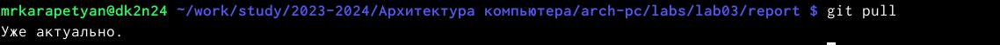
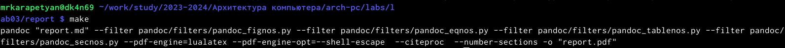
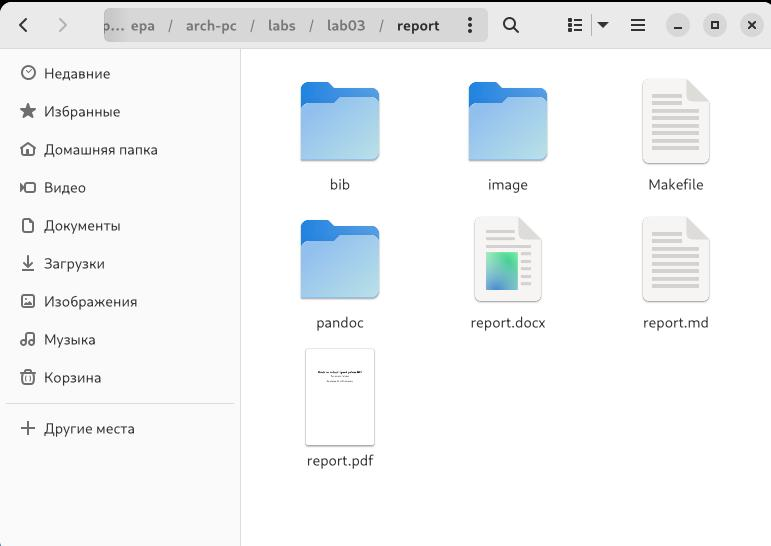
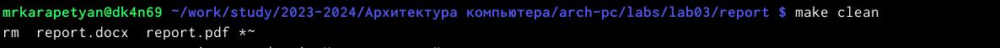
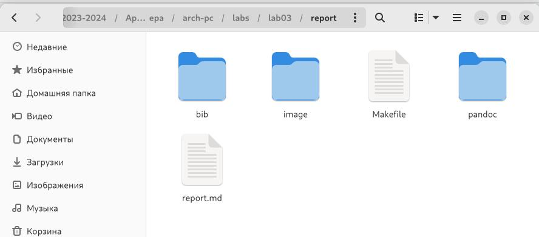

---
## Front matter
title: "Отчёт по лабораторной работе №3"
subtitle: "Язык разметки Markdown"
author: "Карапетян Мари Рафаеловна"

## Generic otions
lang: ru-RU
toc-title: "Содержание"

## Bibliography
bibliography: bib/cite.bib
csl: pandoc/csl/gost-r-7-0-5-2008-numeric.csl

## Pdf output format
toc: true # Table of contents
toc-depth: 2
lof: true # List of figures
lot: true # List of tables
fontsize: 12pt
linestretch: 1.5
papersize: a4
documentclass: scrreprt
## I18n polyglossia
polyglossia-lang:
  name: russian
  options:
	- spelling=modern
	- babelshorthands=true
polyglossia-otherlangs:
  name: english
## I18n babel
babel-lang: russian
babel-otherlangs: english
## Fonts
mainfont: PT Serif
romanfont: PT Serif
sansfont: PT Sans
monofont: PT Mono
mainfontoptions: Ligatures=TeX
romanfontoptions: Ligatures=TeX
sansfontoptions: Ligatures=TeX,Scale=MatchLowercase
monofontoptions: Scale=MatchLowercase,Scale=0.9
## Biblatex
biblatex: true
biblio-style: "gost-numeric"
biblatexoptions:
  - parentracker=true
  - backend=biber
  - hyperref=auto
  - language=auto
  - autolang=other*
  - citestyle=gost-numeric
## Pandoc-crossref LaTeX customization
figureTitle: "Рис."
tableTitle: "Таблица"
listingTitle: "Листинг"
lofTitle: "Список иллюстраций"
lotTitle: "Список таблиц"
lolTitle: "Листинги"
## Misc options
indent: true
header-includes:
  - \usepackage{indentfirst}
  - \usepackage{float} # keep figures where there are in the text
  - \floatplacement{figure}{H} # keep figures where there are in the text
---

# Цель работы

Цель работы является освоение процедуры оформления отчётов с помощью легковесного языка разметки Markdown.

# Задание

Заполнить отчет

# Теоретическое введение

* Обработка файлов в формате Markdown

Преобразовать файл README.md можно следующим образом:

pandoc README.md -o README.pdf

или так

pandoc README.md -o README.docx

Для компиляции отчетов по лабораторным работам предлагается использовать следую-
щий Makefile

FILES = (patsubst %.md, %.docx, (wildcard *.md))
FILES += (patsubst %.md, %.pdf, (wildcard *.md))

LATEX_FORMAT =

FILTER = --filter pandoc-crossref

%.docx: %.md
-pandoc "<" (FILTER) -o "@"

%.pdf: %.md
-pandoc "<" $(LATEX_FORMAT) (FILTER) -o "$@"

all: (FILES)
@echo (FILES)

# Выполнение лабораторной работы
Открыла терминал
Перешла в каталог курса сформированный при выполнении лабораторной работы №2. (Рис. @fig:001).

{#fig:001 width=70%}

обновила локальный репозиторий, скачав изменения из удаленного репозитория (Рис. @fig:002).

{#fig:002 width=70%}

Перешла в каталог с шаблоном отчета по лабораторной работе №3 (Рис. @fig:003).

{#fig:003 width=70%}

Провела компиляцию шаблона с использованием Makefile. (Рис. @fig:004).

{#fig:004 width=70%}

При успешной компиляции должны появиться файлы report.pdf и report.dock. Проверяю корректность полученных файлов. (Рис. @fig:005).

{#fig:005 width=70%}

Удалила полученный файлы с использованием Makefile. (Рис. @fig:006).

{#fig:006 width=70%}

Проверила, что после команды "make clean" файлы report.pdf и report.docx были удалены. (Рис. @fig:007).

{#fig:007 width=70%}

Открыла файл report.md c помощью редактора. (Рис. @fig:008).

{#fig:008 width=70%}

Загружаю файлы на Github.

# Задание для самостоятельной работы 

# Выводы

Освоила процедуры оформления отчетов с помощью легковесного языка разметки Markdown.

# Список литературы{.unnumbered}

::: {#refs}
:::
