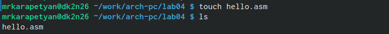
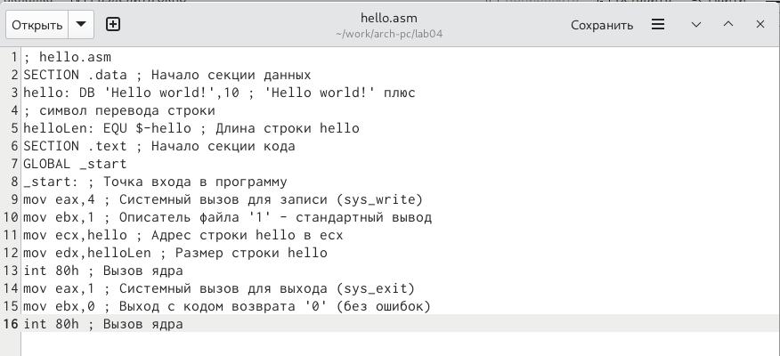
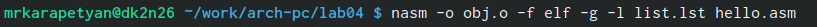
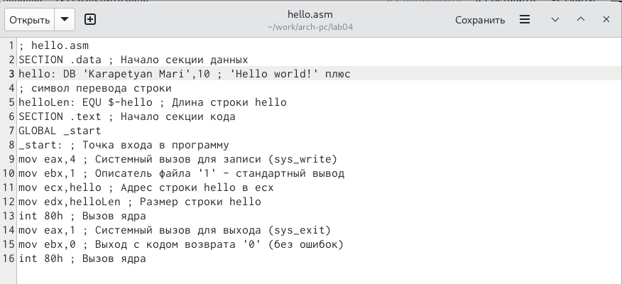
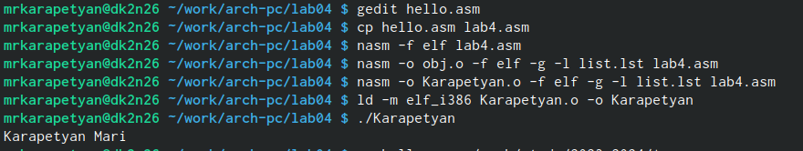
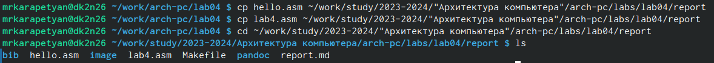

---
## Front matter
title: "Отчет по лбораторной работе №4"
subtitle: "Создание и процесс обработки программ на языке ассемблера NASM"
author: "Карапетян Мари Рафаеловна"

## Generic otions
lang: ru-RU
toc-title: "Содержание"

## Bibliography
bibliography: bib/cite.bib
csl: pandoc/csl/gost-r-7-0-5-2008-numeric.csl

## Pdf output format
toc: true # Table of contents
toc-depth: 2
lof: true # List of figures
lot: true # List of tables
fontsize: 12pt
linestretch: 1.5
papersize: a4
documentclass: scrreprt
## I18n polyglossia
polyglossia-lang:
  name: russian
  options:
	- spelling=modern
	- babelshorthands=true
polyglossia-otherlangs:
  name: english
## I18n babel
babel-lang: russian
babel-otherlangs: english
## Fonts
mainfont: PT Serif
romanfont: PT Serif
sansfont: PT Sans
monofont: PT Mono
mainfontoptions: Ligatures=TeX
romanfontoptions: Ligatures=TeX
sansfontoptions: Ligatures=TeX,Scale=MatchLowercase
monofontoptions: Scale=MatchLowercase,Scale=0.9
## Biblatex
biblatex: true
biblio-style: "gost-numeric"
biblatexoptions:
  - parentracker=true
  - backend=biber
  - hyperref=auto
  - language=auto
  - autolang=other*
  - citestyle=gost-numeric
## Pandoc-crossref LaTeX customization
figureTitle: "Рис."
tableTitle: "Таблица"
listingTitle: "Листинг"
lofTitle: "Список иллюстраций"
lotTitle: "Список таблиц"
lolTitle: "Листинги"
## Misc options
indent: true
header-includes:
  - \usepackage{indentfirst}
  - \usepackage{float} # keep figures where there are in the text
  - \floatplacement{figure}{H} # keep figures where there are in the text
---

# Цель работы

Основные процедуры компиляции и сборки программ, написанных на ассемблере NASM

# Задание

* Программа Hello world!
* Транслятор NASM
* Расширенный синтаксис командной строки NASM
* Компоновщик LD
* Запуск исполняемого файла

# Теоретическое введение

Основные принципы работы компьютера
Основными функциональными элементами любой электронно-вычислительной машины
(ЭВМ) являются центральный процессор, память и периферийные устройства (рис. 4.1).
Взаимодействие этих устройств осуществляется через общую шину, к которой они подклю-
чены. Физически шина представляет собой большое количество проводников, соединяющих
устройства друг с другом. В современных компьютерах проводники выполнены в виде элек-
тропроводящих дорожек на материнской (системной) плате.
Основной задачей процессора является обработка информации, а также организация
координации всех узлов компьютера. В состав центрального процессора (ЦП) входят
следующие устройства:
• арифметико-логическое устройство (АЛУ) — выполняет логические и арифметиче-
ские действия, необходимые для обработки информации, хранящейся в памяти;
• устройство управления (УУ) — обеспечивает управление и контроль всех устройств
компьютера;
• регистры — сверхбыстрая оперативная память небольшого объёма, входящая в со-
став процессора, для временного хранения промежуточных результатов выполнения
инструкций; регистры процессора делятся на два типа: регистры общего назначения и
специальные регистры.
Для того, чтобы писать программы на ассемблере, необходимо знать, какие регистры
процессора существуют и как их можно использовать. Большинство команд в программах
написанных на ассемблере используют регистры в качестве операндов. Практически все
команды представляют собой преобразование данных хранящихся в регистрах процессора,
это например пересылка данных между регистрами или между регистрами и памятью, пре-
образование (арифметические или логические операции) данных хранящихся в регистрах.

# Выполнение лабораторной работы

Создаем каталог для работы с программами на языке ассемблера NASM (Рис.@fig:001)

{#fig:001 width=70%}

Перейдем в созданный каталог (Рис.@fig:002)

{#fig:002 width=70%}

Создайте текстовый файл с именем hello.asm (Рис.@fig:003)

{#fig:003 width=70%}

Откроем этот файл с помощью любого текстового редактора (Рис.@fig:004)

{#fig:004 width=70%}

Введем в него текст (Рис.@fig:005)

{#fig:005 width=70%}

Скомпилируем данный текст (Рис.@fig:006)

{#fig:006 width=70%}

Проверим, что объектный файл был создан (Рис. @fig:007). 

{#fig:007 width=70%}

Скомпилируем исходный файл hello.asm в obj.o и создадим файл листинга list.lst(Рис.@fig:008)

{#fig:008 width=70%}

Проверим, что файлы были созданы (Рис.@fig:009)

{#fig:009 width=70%}

Передадим объектный файл на обработку компоновщику (Рис.@fig:010)

{#fig:010 width=70%}

Проверим, что исполняемый файл hello был создан (Рис.@fig:011)

{#fig:011 width=70%}

Зададим имя создаваемого исполняемого файла (Рис.@fig:012)

![Зададим имя создаваемого исполняемого файла] (image/12.jpg){#fig:012 width=70%}

Запустим на выполнение созданный исполняемый файл, находящийся в текущем каталоге (Рис.@fig:013)

{#fig:013 width=70%}

Создадим копию файла hello.asm с именем lab4.asm (Рис.@fig:014)

{#fig:014 width=70%}

Внесем изменения в текст программы в файле lab4.asm (Рис.@fig:015)

{#fig:015 width=70%}

Оттранслируем полученный текст программы lab4.asm в объектный файл. Выполним компоновку объектного файла и запустим получившийся исполняемый файл (Рис.@fig:016)

{#fig:016 width=70%}

Скопировала файлы hello.asm и lab4.asm в локальный репозиторий в каталог ~/work/study/2023-2024/"Архитектура компьютера"/arch-pc/labs/lab04/ с помощью утилиты cp и проверила наличие файлов с помощью утилиты ls (Рис.@fig:017)

{#fig:017 width=70%}

Загружаю файлы на Github
# Выводы

В ходе выполнения работы, я освоила процедуры компиляции и сборки программ, написанных на ассемблере NASM

# Список литературы{.unnumbered}

::: {#refs}
:::
