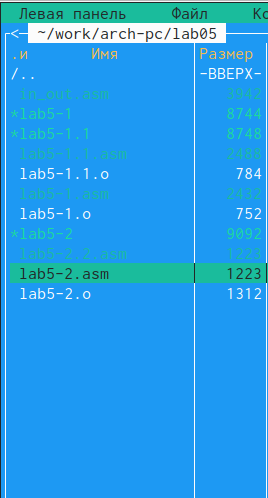

---
## Front matter
title: "Отчет по лабораторной работе №5"
subtitle: "Основы работы с Midnight Commander (mc)"
author: "Карапетян Мари Рафаеловна"

## Generic otions
lang: ru-RU
toc-title: "Содержание"

## Bibliography
bibliography: bib/cite.bib
csl: pandoc/csl/gost-r-7-0-5-2008-numeric.csl

## Pdf output format
toc: true # Table of contents
toc-depth: 2
lof: true # List of figures
lot: true # List of tables
fontsize: 12pt
linestretch: 1.5
papersize: a4
documentclass: scrreprt
## I18n polyglossia
polyglossia-lang:
  name: russian
  options:
	- spelling=modern
	- babelshorthands=true
polyglossia-otherlangs:
  name: english
## I18n babel
babel-lang: russian
babel-otherlangs: english
## Fonts
mainfont: PT Serif
romanfont: PT Serif
sansfont: PT Sans
monofont: PT Mono
mainfontoptions: Ligatures=TeX
romanfontoptions: Ligatures=TeX
sansfontoptions: Ligatures=TeX,Scale=MatchLowercase
monofontoptions: Scale=MatchLowercase,Scale=0.9
## Biblatex
biblatex: true
biblio-style: "gost-numeric"
biblatexoptions:
  - parentracker=true
  - backend=biber
  - hyperref=auto
  - language=auto
  - autolang=other*
  - citestyle=gost-numeric
## Pandoc-crossref LaTeX customization
figureTitle: "Рис."
tableTitle: "Таблица"
listingTitle: "Листинг"
lofTitle: "Список иллюстраций"
lotTitle: "Список таблиц"
lolTitle: "Листинги"
## Misc options
indent: true
header-includes:
  - \usepackage{indentfirst}
  - \usepackage{float} # keep figures where there are in the text
  - \floatplacement{figure}{H} # keep figures where there are in the text
---

# Цель работы

Приобретение практических навыков работы в Midnight Commander. Освоение инструкций
языка ассемблера mov и int.

# Задание

Здесь приводится описание задания в соответствии с рекомендациями
методического пособия и выданным вариантом.

# Теоретическое введение

5.2.1. Основы работы с Midnight Commander
Midnight Commander (или просто mc) — это программа, которая позволяет просматривать
структуру каталогов и выполнять основные операции по управлению файловой системой,
т.е. mc является файловым менеджером. Midnight Commander позволяет сделать работу с
файлами более удобной и наглядной.
Для активации оболочки Midnight Commander достаточно ввести в командной строке mc и
нажать клавишу Enter (рис. 5.1).
В Midnight Commander используются функциональные клавиши F1 — F10 , к которым
привязаны часто выполняемые операции (табл. 5.1).

5.2.2. Структура программы на языке ассемблера NASM
Программа на языке ассемблера NASM, как правило, состоит из трёх секций: секция кода
программы (SECTION .text), секция инициированных (известных во время компиляции)
данных (SECTION .data) и секция неинициализированных данных (тех, под которые во
время компиляции только отводится память, а значение присваивается в ходе выполнения
программы) (SECTION .bss).

# Выполнение лабораторной работы
С помощью команды mc открыла Midnight Commander,нашла файл lab5-1.asm,зашла в него и ввела нужный текст(Рис.@fig:001)

{#fig:001 width=70%}

Оттранслируйте текст программы lab5-1.asm в объектный файл. Выполните компоновку объектного файла и запустите получившийся исполняемый файл и ввела свои имя и фамилию(Рис.@fig:002)

{#fig:002 width=70%}

Подключение внешнего файла in_out.asm(Рис.@fig:003)

{#fig:003 width=70%}

Создала копию файла lab5-1.asm с именем lab5-2.asm и редоктировала в нем текст(Рис.@fig:004)

{#fig:004 width=70%}

Оттранслируйте текст программы lab5-2.asm в объектный файл. Выполните компоновку объектного файла и запустите получившийся исполняемый файл и ввела свои имя и фамилию(Рис.@fig:005)

{#fig:005 width=70%}

Копирую файл lab5-1.asm с именем lab5-1.1.asm(Рис.@fig:006)

{#fig:001 width=70%}

# Выполнение самостоятельной работы

Копирую файл lab5-1.asm с именем lab5-1.1.asm(Рис.@fig:006)

{#fig:006 width=70%}

Изменяю код программы,добавляя вывод введенной строки(Рис.@fig:007)

{#fig:007 width=70%}

Создаю объектный файл lab5-1.1.o,компоную его в исполняемый файл,запускаю исполняемый файл(Рис.@fig:008)

{#fig:008 width=70%}

Копирую файл lab5-2.asm с именем lab5-2.2.asm(Рис.@fig:009)

{#fig:009 width=70%}

Изменяю код программы,добавляя вывод введенной строки(Рис.@fig:0010)

{#fig:0010 width=70%}

Создаю объектный файл lab5-2.2.o,компоную его в исполняемый файл,запускаю исполняемый файл(Рис.@fig:0011)

{#fig:008 width=70%}

# Выводы

Я приобрела практические навыки работы в Midnight Commander. Освоила инструкции
языка ассемблера mov и int.

# Список литературы{.unnumbered}

GDB: The GNU Project Debugger. — URL: https://www.gnu.org/software/gdb/.
GNU Bash Manual. — 2016. — URL: https://www.gnu.org/software/bash/manual/.
Midnight Commander Development Center. — 2021. — URL: https://midnight-commander.
org/.
NASM Assembly Language Tutorials. — 2021. — URL: https://asmtutor.com/.
Newham C. Learning the bash Shell: Unix Shell Programming. — O’Reilly Media, 2005. —
354 с. — (In a Nutshell). — ISBN 0596009658. — URL: http://www.amazon.com/Learning-
bash-Shell-Programming-Nutshell/dp/0596009658.
Robbins A. Bash Pocket Reference. — O’Reilly Media, 2016. — 156 с. — ISBN 978-1491941591.
The NASM documentation. — 2021. — URL: https://www.nasm.us/docs.php.
Zarrelli G. Mastering Bash. — Packt Publishing, 2017. — 502 с. — ISBN 9781784396879.
Колдаев В. Д., Лупин С. А. Архитектура ЭВМ. — М. : Форум, 2018.
Куляс О. Л., Никитин К. А. Курс программирования на ASSEMBLER. — М. : Солон-Пресс,
2017.
Новожилов О. П. Архитектура ЭВМ и систем. — М. : Юрайт, 2016.
Расширенный ассемблер: NASM. — 2021. — URL: https://www.opennet.ru/docs/RUS/nasm/.
Робачевский А., Немнюгин С., Стесик О. Операционная система UNIX. — 2-е изд. — БХВ-
Петербург, 2010. — 656 с. — ISBN 978-5-94157-538-1.
Столяров А. Программирование на языке ассемблера NASM для ОС Unix. — 2-е изд. —
М. : МАКС Пресс, 2011. — URL: http://www.stolyarov.info/books/asm_unix.
Таненбаум Э. Архитектура компьютера. — 6-е изд. — СПб. : Питер, 2013. — 874 с. —
(Классика Computer Science).
Таненбаум Э., Бос Х. Современные операционные системы. — 4-е изд. — СПб. : Питер,2015. — 1120 с. — (Классика Computer Science).
